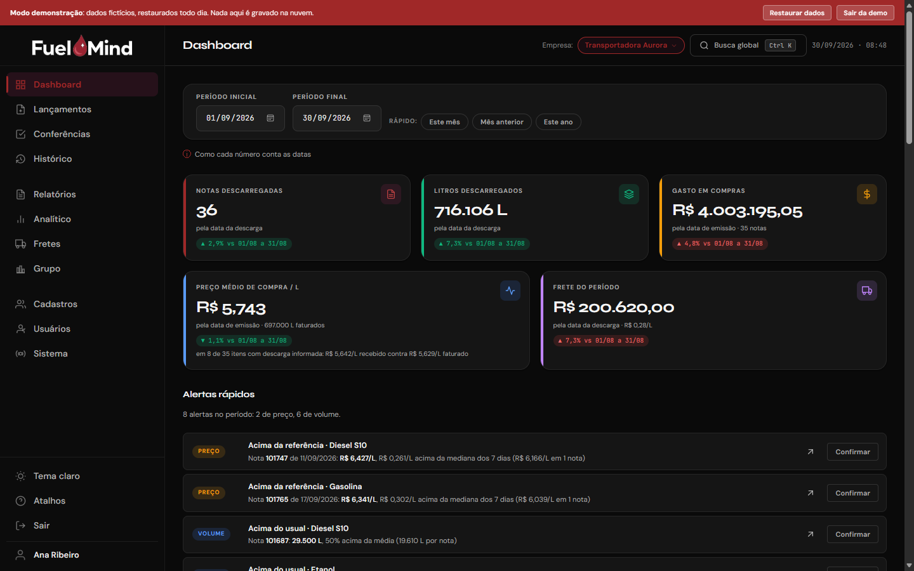
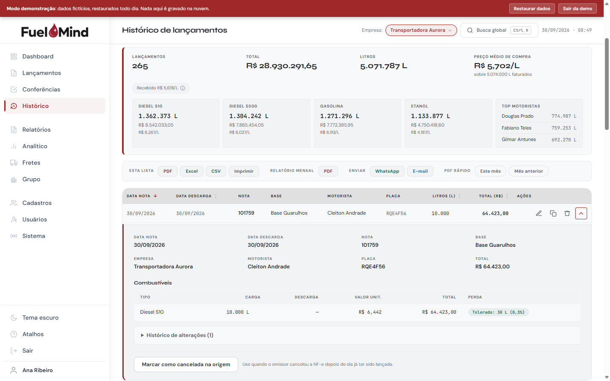
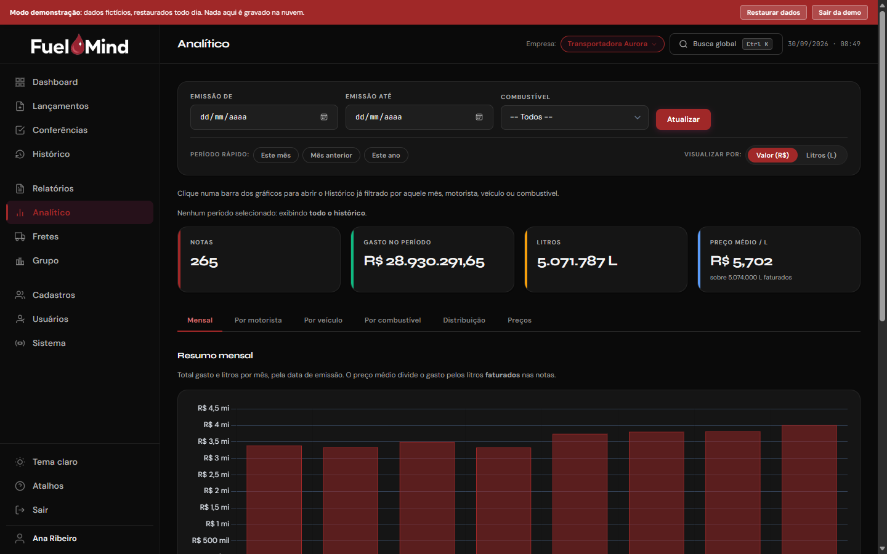
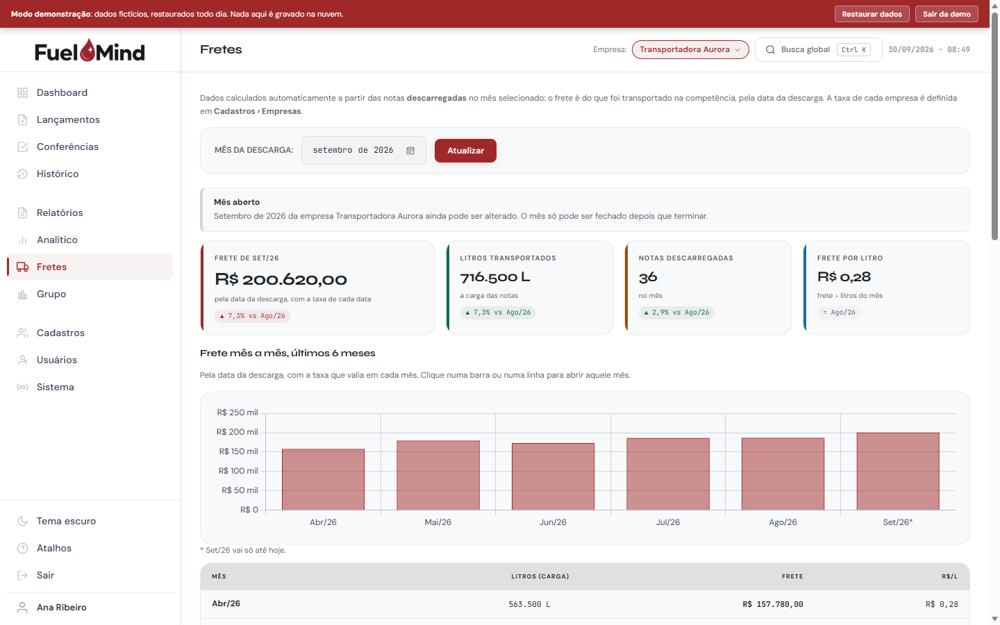
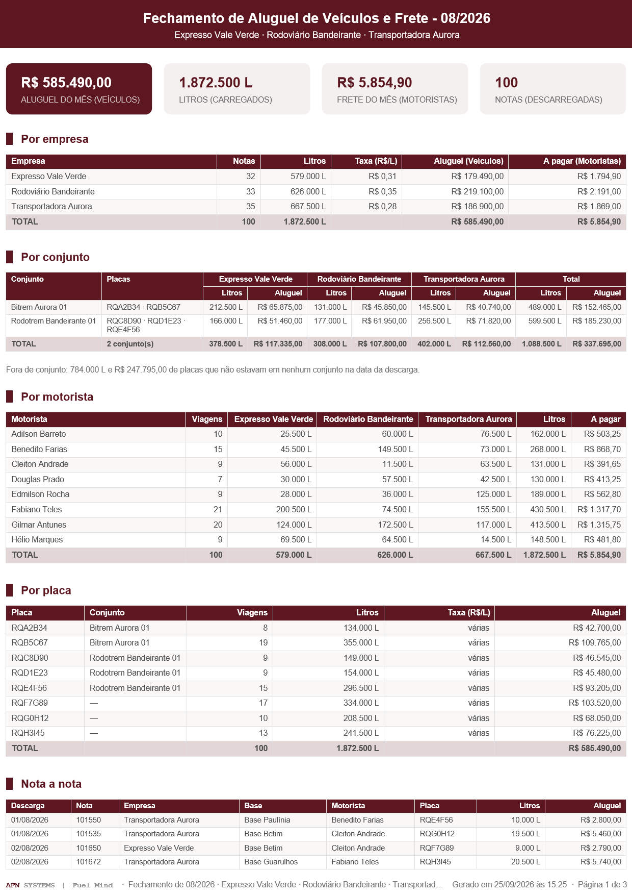
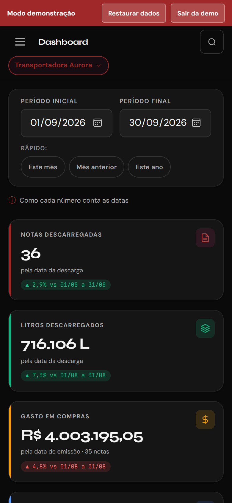

# Fuel Mind

Fuel Mind is a web system for controlling fuel purchases and freight in a
group of companies that buy fuel from distributors and pay the carriers
by the litre. Each invoice (NF-e) is entered once, typed or imported from
its XML file, and everything else comes from it: purchase cost, price
alerts, the freight owed per plate, driver, company and vehicle set, and
the month-end documents.

It was built for a fuel operation in Brazil that kept this control in
spreadsheets. It is plain JavaScript on top of Firebase, with no
framework and no build step.

**Live demo: [controle-entradas-posto.web.app](https://controle-entradas-posto.web.app)** (no sign-up)

Click **Acessar modo demo** and pick one of the three profiles. Each one
sees a different set of companies and screens, which is the quickest way
to see the access rules at work. The demo runs on eight months of
fictional data, keeps everything in your browser and resets every day.


The interface, the code comments and the commit messages are in
Brazilian Portuguese, since the people who use it are Brazilian. This
README is also available in [Portuguese](README.pt-BR.md).

## Screenshots

Taken from the demo, with its fictional data.

| Dashboard, dark theme | Entry history with an invoice open, light theme |
|---|---|
|  |  |
| **Analytics** | **Freight** |
|  |  |

| Month-end closing, generated as a PDF | On a phone |
|---|---|
|  |  |

## What it does

### Entering invoices

- Importing the NF-e XML fills in the form: dates, number, fuels,
  quantities and prices. The distribution base is found from the
  supplier's name and city in the invoice; when nothing matches, the
  system asks once and remembers the answer.
- Several fuels per invoice, with the loaded and the unloaded quantity.
  The transit loss is checked against a tolerance set for each fuel.
- Checks before saving: unload date before the invoice date, dates in
  the future, an invoice number already entered, and a unit price too far
  from the median of the previous days for that fuel.
- A form left half filled is kept as a draft. Invoices can be cloned,
  edited, cancelled or deleted, and every change goes into the invoice's
  history. Deleted invoices are kept and marked, not erased.

### History and reports

- Entry history filtered by invoice date and by unload date at the same
  time, which is how the invoices that cross a month boundary show up.
- A report hub that lists everything the system produces. Each item
  generates its file right there, for the month chosen on the page.
- PDF and Excel files share one visual standard: month-end closing,
  freight summary, freight per invoice, monthly purchase report, entry
  list and company comparison. CSV where it is useful, and a short
  summary to send by WhatsApp or e-mail.

### Freight

- Freight rate per company (R$ per litre) and the driver's share (% of
  the freight), both with validity periods: a new rate applies from its
  date on, and past months keep their numbers.
- Freight per plate, driver, company and vehicle set, counted by unload
  date. A vehicle set is resolved by the plates it had on the date of
  each trip.
- Month closing: an administrator closes a company's month, and until
  someone reopens it no invoice unloaded in that month can be added,
  changed or removed, nor can the rates for those days. Who may close and
  reopen is enforced by the database rules; the lock on the invoices is
  enforced by the application.

### Dashboard and analytics

- Totals for the period with the change against the previous period,
  alerts for unusual prices, volumes and dates, the latest entries for
  each fuel and a six-month view.
- Analytics tabs: monthly, per driver, per vehicle, per fuel,
  distribution and price per litre. Clicking a bar opens the history
  already filtered.
- A group view that puts side by side the companies a profile can see.

### Reconciliation

- The tank report exported from AutoSystem (the station management
  software) is compared, day by day, with the invoices entered.

### Access control

- Three profiles: Supremo (everything), Admin (the companies assigned to
  them, plus their users) and Operador (enters and checks invoices).
  Freight per person and the quantities per driver, plate and vehicle
  set are shown to Admin and Supremo only.
- Each company's invoices live in their own Firestore document, and the
  security rules only let a user read the documents of the companies in
  their profile.
- Login with e-mail or @username, through a small public index that maps
  each username to its e-mail.

### Day to day

- Short connection drops do not lose work: changes are kept in the
  browser and sent when the connection returns, and changes made by other
  users arrive in real time.
- A daily automatic backup in the browser (the last 7 are kept) and a
  full backup download. Restoring is limited to Supremo.
- Spreadsheet import for past entries (three layouts, detected from the
  header, with a column mapping step) and for the fleet registry. Nothing
  is saved before a preview.
- Search and commands with Ctrl+K, keyboard shortcuts, light and dark
  themes, and a layout that works on a phone.

## How it is built

| Part | Technology |
|---|---|
| Interface | HTML, CSS and JavaScript, no framework and no build step |
| Data and login | Firebase Firestore (real time) and Firebase Authentication |
| Charts | Chart.js 4 |
| PDF | jsPDF and jsPDF-AutoTable |
| Excel | xlsx-js-style (SheetJS with cell styles) |
| Hosting | Firebase Hosting |

The PDF and Excel libraries are loaded from a CDN only when a document is
generated.

Some decisions behind it:

- **The database rules are the security boundary.** Which companies a
  user reads, who manages users and who closes a month are enforced in
  `firestore.rules`; the screens only avoid offering what the rules would
  refuse. The one exception is hiding freight details from the Operador
  profile, which is done in the interface.
- **Numbers typed the Brazilian way** (1.234,56) go through a small input
  layer instead of `<input type="number">`, which in pt-BR browsers can
  change a value without warning.
- **The calculations that decide money are tested**: the freight engine,
  rate validity periods, the price reference, the month-closing lock, the
  NF-e base matching, number formatting and the PDF and Excel layout.
  `node --test tests/*.test.js` runs the 102 tests with no dependencies.

## Running your own copy

1. Clone the repository:
   ```bash
   git clone https://github.com/alyssom-fernandes/Fuel-Mind.git
   ```
2. Create a Firebase project with Firestore and Email/Password
   authentication.
3. Put your project's web config in `src/core/firebase.js` and its id in
   `.firebaserc`.
4. Publish the rules from this repository:
   ```bash
   firebase deploy --only firestore:rules
   ```
5. Create the first user in Authentication, then a Firestore document
   `usuarios/{uid}` with `nome`, `email`, `role: "supremo"`,
   `ativo: true`, `empresas: []` and `empresaIds: []`.
6. Serve the folder with `firebase deploy --only hosting`, or locally
   with any static server, such as `npx serve .`. The app uses ES
   modules, so opening `index.html` straight from the disk does not work.

The demo mode needs none of this: serve the folder and click
**Acessar modo demo**.

The Firebase web config in `src/core/firebase.js` is public by design;
what protects the data is `firestore.rules`.

## Project structure

```
index.html              the whole app: every screen and dialog
404.html
firebase.json           hosting settings
firestore.rules         database security rules
assets/
  style.css             light and dark themes, CSS variables
  logo-dark.svg, logo-light.svg
  screenshots/
src/
  core/                 data, session and infrastructure
    firebase.js         Firebase setup, database and login calls
    sessao.js           login, profiles, active company, permissions
    dados.js            in-memory state
    sincronizacao.js    saving, offline queue, real-time updates
    navegacao.js        screen switching, toasts
    tema.js             light and dark theme
    backup.js           backup and restore
    erros.js            local failure log
  shared/               used by every screen
    utils.js            formatting, freight engine, shared rules
    pdf-padrao.js       the common PDF layout
    planilha-padrao.js  the common Excel layout
    mes-fechado.js      month-closing lock
    base-nfe.js         matching an NF-e to a distribution base
    validacao.js        invoice form checks
    numerico.js         Brazilian number input
    combobox.js         autocomplete field
    rascunho.js         form draft
    ui.js               sidebar, search, shortcuts
  screens/              one screen per file
    dashboard.js, lancamentos.js (invoice form), relatorios.js (history),
    central.js (report hub), analitico.js, fretes.js, fechamento.js,
    grupo.js, cadastros.js, cadastros-importar.js, importacao.js,
    sistema.js (backup, settings, reconciliation), usuarios.js, demo.js
tests/                  node --test, no dependencies
```

## License

[MIT](LICENSE). Made by Alyssom Fernandes.
